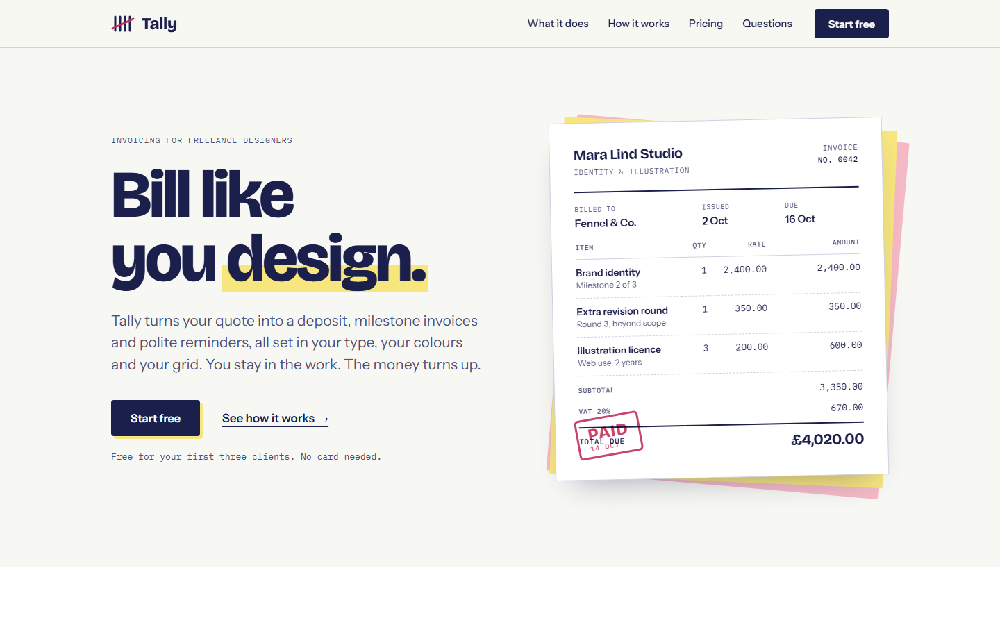
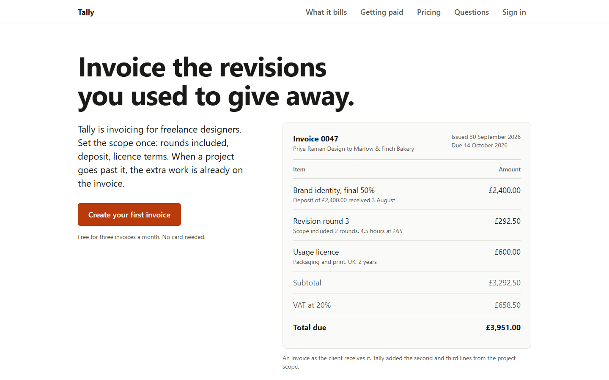
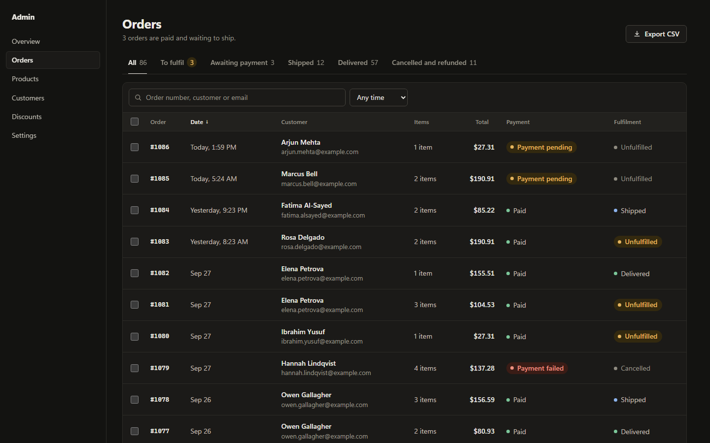
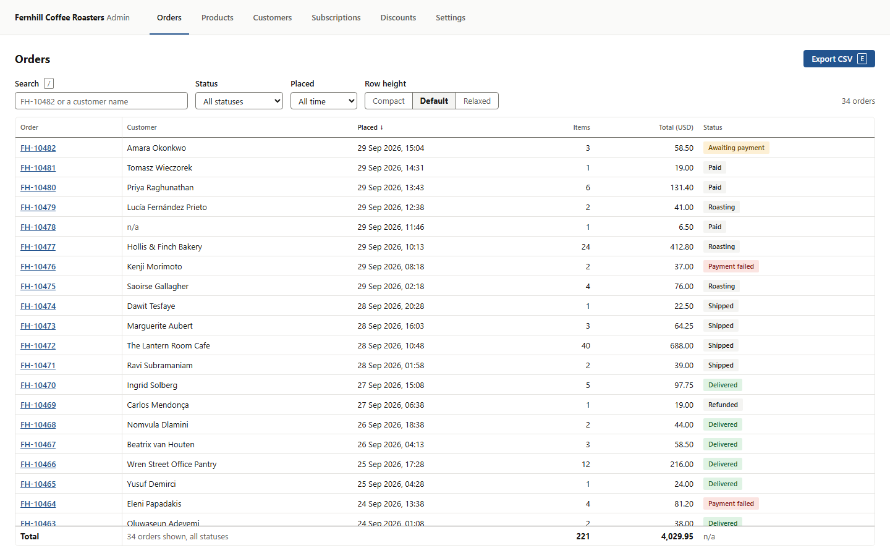
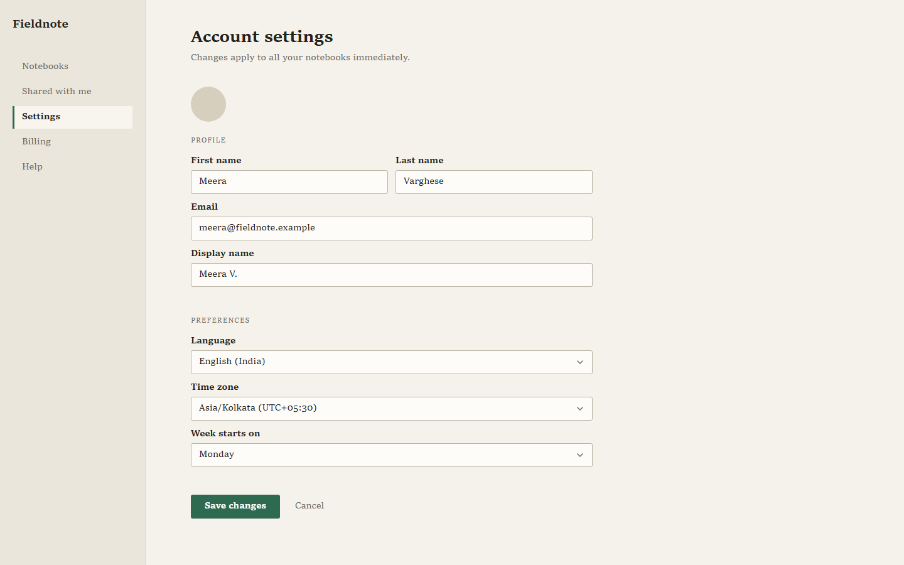
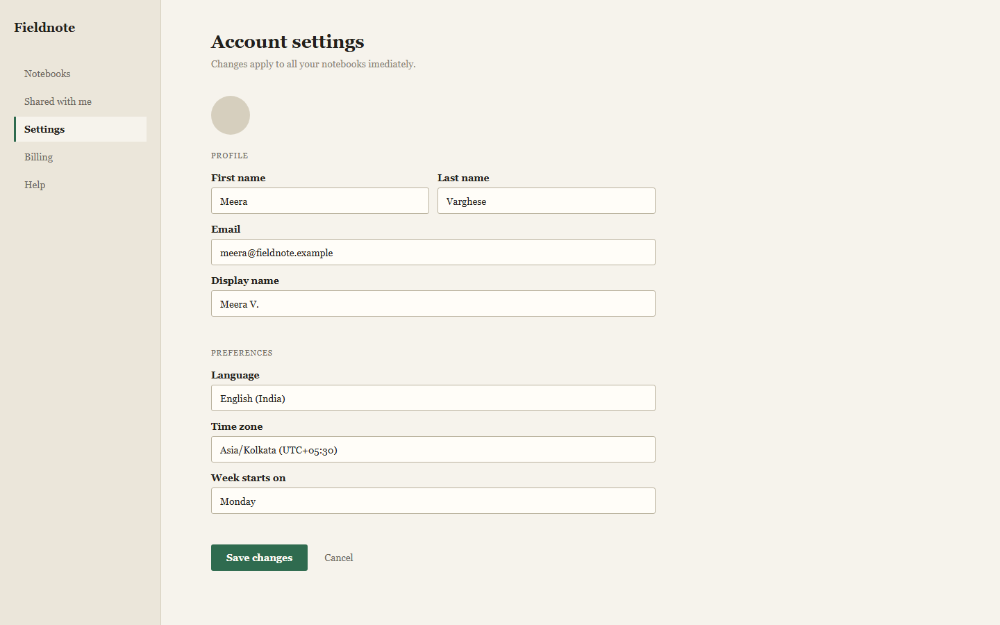
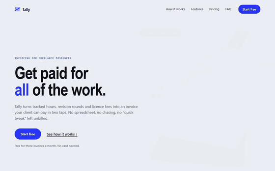
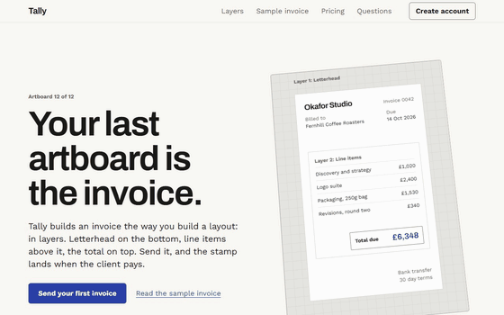

# design-toolkit

A UI and UX kit for frontend work done with a coding agent. It is a set of skills and design tokens that Claude Code, or any agent that reads skills, picks up before it writes interface code.

## What this is

Ask an agent for a landing page and you get the same one every time: a gradient hero, three cards with icons, centred text, soft shadows on everything. Asking it to "make it less generic" afterwards does not work well, because the agent has nothing specific to aim at. So I stopped fighting the outputs and fixed the inputs. This kit gives the agent a short list of rules, real tokens to build with, and a test to run on its own work before I see it.

## Install

Clone it somewhere you will keep it, then run the script:

```sh
git clone https://github.com/ishwar-iyer12/design-toolkit.git
cd design-toolkit
./install.sh
```

That links each folder in `skills/` into `~/.claude/skills`. It prints every link it makes, skips anything already there, and overwrites nothing. Run it twice and the second run changes nothing.

To install for one project only, run it from that project:

```sh
cd my-project
/path/to/design-toolkit/install.sh --project
```

`./install.sh --remove` takes the links out again.

If you do not trust scripts, make the links by hand:

```sh
mkdir -p ~/.claude/skills
ln -s /path/to/design-toolkit/skills/taste ~/.claude/skills/taste
ln -s /path/to/design-toolkit/skills/image-to-code ~/.claude/skills/image-to-code
ln -s /path/to/design-toolkit/skills/motion ~/.claude/skills/motion
ln -s /path/to/design-toolkit/skills/web-design-guidelines ~/.claude/skills/web-design-guidelines
ln -s /path/to/design-toolkit/skills/awesome-design ~/.claude/skills/awesome-design
```

Use links, not copies. The skills read tokens from `design-systems/`, which they find relative to the kit. On Windows, links need Developer Mode or an administrator shell.

Other agents: point yours at the `skills/` folder, or paste `skills/taste/SKILL.md` into whatever instruction file it reads.

## How I use it

I name the skill and the variant in the prompt, and I give it real content. Three examples:

```text
Use the taste skill with the dashboard variant. Build the invoices table: number, client, issued, due, amount, status. Start with the empty state.
```

```text
Use image-to-code on mockups/checkout.png. React and plain CSS. Put the divergence table at the top of Checkout.css.
```

```text
Review src/components against the web design guidelines, then fix only what fails.
```

The agent reports which variant it used, what the accent colour marks, and whether its output passed the smell test. If that report is missing, the skill did not load.

## What it produces

I ran four prompts with no skills and with the kit. These are the results, one run per cell, top of each page.

| Prompt | Without the kit | With the kit |
| --- | --- | --- |
| Landing page |  |  |
| Orders table |  |  |
| Match a mockup |  |  |
| Landing page with 3D |  |  |

The pages without the kit are not ugly. In the first row the page without the kit is the better looking one, which is why the `showcase` variant and the `motion` skill exist: the last row uses them. Even there it took three attempts: the first was too timid, the second had a bug in the animation, and I revised the skill after each. What the kit changes reliably shows up when you count:

| Measure | Without | With |
| --- | --- | --- |
| Landing page: font sizes | 17 | 5 |
| Landing page: spacing values off the 4px grid | 11 | 0 |
| Landing page: shadows, gradients and blurs | 14 | 0 |
| Orders table: states built (loading, empty, no matches, failed) | 1 of 4 | 4 of 4 |
| Mockup match: pixels that differ from the source, of 5,184,000 | 4,379,452 | 3 |
| Mockup match: differences from the source listed in the output | 3 | 18 |
| 3D page: font sizes | 22 | 5 |
| 3D page: reduced-motion rules | 2 | 9 |

The code for every run is in `examples/runs/`, with the reply each run gave. `examples/before-after.md` has the full account, including what the kit got wrong.

## Skills

| Skill | What it does |
| --- | --- |
| `taste` | Rules the agent applies before writing UI, and a smell test it runs afterwards. |
| `image-to-code` | Turns a screenshot or mockup into matching code and records every divergence. |
| `motion` | Rules for animation and 3D: one signature, timing, depth that lasts, reduced motion. |
| `web-design-guidelines` | Reviews UI code against Vercel's Web Interface Guidelines. Vendored. |
| `awesome-design` | 74 DESIGN.md references for building in the style of a known product. Vendored. |

## Design systems

Each variant is a `tokens.json` that overrides `base`, plus a README on when to pick it.

| Variant | Pick it when |
| --- | --- |
| `base` | Nothing else fits, or you are building an ordinary app screen. Has `tokens.css`, component rules and accessibility minimums. |
| `editorial` | People will read for more than a minute. Serif pairing, a 66 character measure, a 30px baseline. |
| `dashboard` | Someone compares many values every day. Dense tables, aligned numbers, chart colour rules. |
| `marketing` | The page is read once, quickly. Big hierarchy, one accent, wide section rhythm. |
| `showcase` | The page has to be remembered. A concept, a display typeface, depth, one signature animation. |

Your own tokens always win. If the project already has a design system, tell the agent where it is and keep the rules from `taste`.

## Credits and licences

My work here is under the MIT licence, see `LICENSE`.

Two skills are vendored from other people's repositories, both MIT, each with its original licence file and a notice listing what I changed. `CREDITS.md` has every source, the commit I took, and the decision I made for each.
